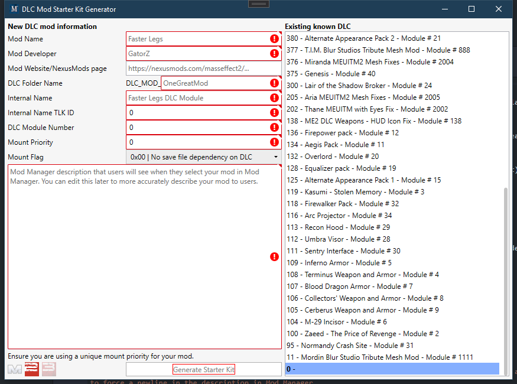

## Creating a mod for ME3Tweaks Mod Manager
If you are planning to create mods with ME3Tweaks Mod Manager, you should ensure your local installation of M3 is in developer mode. Turn this feature on in the Actions > Options menu. This will enable developer oriented features.

To create a mod for M3, you will need to know what kind you are making. Most developers will be creating a singleplayer-only CustomDLC (DLC mod that overrides or adds some game files), which can be very easily created with Starter Kit. 

You can create a fully working, blank DLC mod by going to Tools > Generate new DLC mod (Starter Kit) > \[Game\].

### Starter Kit


Starter kit is an easy to use DLC generator that produces a working, blank DLC mod. The values you must enter are described below.

#### Mod Name
Name of your mod that is shown to users in Mod Manager

#### Mod Developer
The developer of the mod. Use your handle.

#### Mod Website
The link that is shown to users when your mod is selected. This is also used to enable endorsements, if it is a valid NexusMods page.

#### DLC Folder Name
The suffix for your DLC mod (appended to DLC_MOD_) Changing this at a later date requires a lot of manual work, so choose wisely!

#### Internal name
The 'name' of your DLC mod. This string will be shown to users if your mod fails to load in-game. Typically you can just set it to the name of your mod. It can be changed later with a TLK editor by editing the TLK files.

#### Internal Name TLK ID:
The StringRef ID for the Internal Name. Strings are localized in Mass Effect games by an integer value, called `StringRef`, or StrRef. You can choose a random number between 1 and 2 billion and you will typically be fine. Keyword here is _random_.

#### DLC Module Number
This only applies to ME2. Tee module number determines the TLK filename. So it must be unique and greater than 0. You can pretty much pick anything that isn't already taken, the values does not matter.

#### Mount priority
The priority for overriding other files, higher numbers override lower ones. M3 purposely limits the values you can use to prevent you from choosing high values that break larger, more established mods that are widely used. The mount can be changed later in Mount Editor in ME3Explorer. Creating high priority mods that break other big mods will quickly anger other developers and end users.

### Manual creation

If you wish to make one manually, you can do so using this quick and easy template if you want to deploy a CustomDLC mod (mod that adds only a DLC to the game). Edit the variable names as necessary and save as moddesc.ini next to your mod's DLC folder.

```
[ModManager]
cmmver = 6

[ModInfo]
modname = Your Mod Name Here
moddev = Your Name Here
modver = 1.0.0.0
moddesc = Set your description that will show in Mod Manager here. The description must be done on a single line as ini files are parsed per linebreak. You can use the <br> tag to force a newline in the description in Mod Manager.
modsite = http://example.com

[CUSTOMDLC]
sourcedirs = DLC_YOUR_NAME_HERE
destdirs = DLC_YOUR_NAME_HERE
```
**modver** is the version number of your mod. Ensure it is follows one of these formats: W, W.X, W.X.Y, or W.X.Y.Z.

#### If targeting cmmver 6 or higher
The value should be a version number, such as _1.0.1_, _1.2.4.11_ or _1.2_, **but not 1**). A single value without a digit is not a version number. Note that 1.01 and 1.1 are the same, as each set of values is considered an integer! 1.02 is a higher version number than 1.1 due to this.

#### If targeting cmmver 5.1 or lower
The value should be a floating point number, such as 1.2 or 1.33. ME3CMM did not support semantic version numbers, only floating point numbers. M3 does not use floating point version numbers, so you should consider just using values such as 1.1, 1.2, etc.

The **modsite** value will be a clickable link in the description panel of the mod, so users can go directly to your mod's page (e.g. nexusmods page). If you don't know the NexusMods URL, you can find the base url of it once you start creating your mod page. If you use a NexusMods URL, ensure it is only the main page URL.

Correct:
```
https://www.nexusmods.com/masseffect3/mods/811
https://www.nexusmods.com/masseffect3/mods/807
```
Not correct:
```
https://www.nexusmods.com/masseffect3/mods/811?tab=posts
https://www.nexusmods.com/masseffect3/mods/807?tab=files
```

### Deploying your mod
You should deploy your mod through M3 by going to the Mod Utils menu and doing Developer options > Deploy Mod. Deploying a mod prepares it for distribution through a highly optimized 7z file that features high compression (so users spend less time downloading, you spend less time uploading) while having very fast parsing support when the file is dropped onto M3.

Mods targeting moddesc 6.0 or higher will throw warning dialogs if their archive file is opened and it the archive is detected as not having been deployed through M3. More information on deployment is available on the [deployment documention](moddeployment.md) page.
