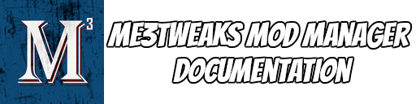

# Merge mods - Creating an .m3m file

Merge mods, or .m3m mods, are a modding format unique to M3 that allow direct updates to basegame package files. Rather than shipping, for example, an entire SFXGame.pcc file with your edits, with merge mods you can ship a small .m3m file that contain only the values you want to change. This way, a user can install several different mods that target different parts of SFXGame.pcc and other basegame files without the need for patches or other compatibility problems. With merge mods, you can update properties, scripts, skip sequence objects, and perform asset merges, which are effectively the `Replace with relink` feature in Legendary Explorer. They also can apply across localizations of basegame only files, so you only need to make one set of changes to make them work with all localized versions.

The merge mod system is interwoven into the moddesc.ini system, and can take full advantage of the alternates system.

An .m3m mod is created by M3 from a user-created .JSON file. This .JSON file, hereafter referred to as the manifest file, contains information on which game, which file, and which properties will be updated. The manifest file may also contain references to other assets or scripts you would like to have included in your mod. Your manifest file is compiled with all referenced assets to create a binary .m3m file, which is what you distribute to users in your mod. This page outlines the .JSON file format to create an .m3m mod.

```json
{
  "game": "LE1",
  "files": [
    {
      "filename": "SFXGame.pcc",
      "changes": [
        {
          "entryname": "Default__SFXCameraMode_ExploreStorm",
          "propertyupdates": [
            {
              "propertyname": "bIsCameraShakeEnabled",
              "propertytype": "BoolProperty",
              "propertyvalue": "False"
            }
          ]
        },
        {
          "entryname": "Default__SFXCameraMode_CombatStorm",
          "propertyupdates": [
            {
              "propertyname": "bIsCameraShakeEnabled",
              "propertytype": "BoolProperty",
              "propertyvalue": "False"
            }
          ]
        }
      ]
    }
  ]
}
```

*An example merge mod .JSON manifest file*


## .JSON File Format

If you are not familiar with .JSON files, I suggest you [read this article](https://docs.fileformat.com/web/json/) to gain an understanding of the format. JSON is made up of key-value pairs, where a key is a string, and a value can be one of many types, such as a string or a number. The type can also be an array of more values, denoted by square brackets, or an object containing more key-value pairs, which is denoted by curly braces.

The .m3m manifest file is a hierarchy of updates. At the top level, you describe the game you are targeting, and with each level you move down through file specification, export specification, and finally direct property updates. An .m3m can update multiple entries in multiple files, through a variety of different methods. You can directly update property values, or replace entire exports from local package files.

Each of the following sections details the schema for each level of the hierarchy, and lays out the relationships between them. All properties are required unless noted otherwise. Above you can see an example of a very simple manifest file directly updating some properties.

### Top level JSON format

These properties should exist within the outermost set of curly braces in your manifest file.

| Property Name | Type         | Information                                                  |
| ------------- | ------------ | ------------------------------------------------------------ |
| game          | string       | The game you are targeting. Options: ME1, ME2, ME3, LE1, LE2, LE3 |
| files         | array[files] | A list of files your merge mod targets. See the file JSON format below |

**Example:**

```
{
    "game": "LE3",
    "files": [
        // your file updates here
     ]
}
```


### `files` JSON format

The JSON format for a file update in a merge mod. The files property is an array of file update objects. You may update more than one file in a single manifest.

| Property Name           | Type          | Information                                                  |
| ----------------------- | ------------- | ------------------------------------------------------------ |
| filename                | string        | The full name of the file you are targeting.                 |
| applytoalllocalizations | boolean       | Optional. Whether your merge mod should apply to all localized versions. For example, if you are updating Startup_INT, this would apply the merge to all other Startup localizations. The target file can have a localization on it (Such as Startup_INT.pcc), or just be the basename, such as Startup.pcc. When this value is set to true, changes ONLY apply to localized files; that is, if your target file does not have a langauge code, it should not use this flag. In Mod Manager 8, if this case is detected on installation, the merge mod will fully abort installation |
| changes                 | array[change] | An array of desired export changes. See the change JSON format below. |

**Example:**

```
"files" : [
	{
        "filename": "SFXGame.pcc",
        "changes": [
            // your desired changes here
        ]
    },
    {
        "filename": "Startup_INT.pcc",
        "applytoalllocalizations": true,
        "changes": [
            // your changes to all localizations here
        ]
    }
]
```


### `changes` JSON format

This is the JSON format for an update to a specific export in a file. The changes property is an array of single export change objects. 

The entryname must be the full instanced path for the entry you are trying to update, which means you must include all parent entry names, separated by a `.`. For example, if you are trying to update the `AdjustMouseSensitivity` function that is a child of the `BioPlayerInput`  export, your entry name must be `BioPlayerInput.AdjustMouseSensitivity`. This includes any object indexes. The full instanced path for an export can be seen at the "Currently loaded export" container in the Properties panel in Package Editor.

You may have one of either a `propertyupdates`, a `scriptupdate`, or an `assetupdate` for an export. You may not have more than one. In other words, you may only update this export via one of the three available methods.

| Property Name   | Type                  | Information                                                  |
| --------------- | --------------------- | ------------------------------------------------------------ |
| entryname       | string                | The full instanced path of the entry you are targeting.      |
| propertyupdates | array[propertyupdate] | A list of property updates                                   |
| scriptupdate    | scriptupdate object   | A direct script replacement, only available when updating an UnrealScript function export |
| assetupdate     | assetupdate object    | A full asset replacement from a local package file           |
| disableconfigupdate     | bool    | Disables an entries' "Config" flag so it does not read from Coalesced           |


### `propertyupdates` JSON format

The format for a single property update for an export. You may have several of these in the `propertyupdates` array.

| Property Name | Type   | Information                                                  |
| ------------- | ------ | ------------------------------------------------------------ |
| propertyname  | string | The full name of the property. If updating a struct, include the name of the struct, separated by a '.'. For example, Offset.X to update X in the Offset StructProperty. |
| propertytype  | string | The property type. The value must be the final property type to update, if this is part of a nested struct. Supported types are below. |
| propertyvalue | string | The updated property value, <u>as a string</u>               |

**Supported Property Types:**

- BoolProperty
- FloatProperty
- IntProperty
- StrProperty
- NameProperty
- EnumProperty - This is the same as ByteProperty(Enum). Pass in EnumType.Value as propertyvalue. Example: `FireMode.FireMode_FullAuto` for a FireMode enum
- ObjectProperty - Does not support porting in, only relinking to existing objects. Pass in full instanced path as propertyvalue

**Example:**

```
{ // This example would update three properties on the specified entry
    "entryname": "Default__SFXCameraMode_CombatStorm",
    "propertyupdates": [
        {
            "propertyname": "bIsCameraShakeEnabled",
            "propertytype": "BoolProperty",
            "propertyvalue": "True"
        },
        {
            "propertyname": "Offset.X", // This updates the "X" property of the "Offset" StructProperty
            "propertytype": "FloatProperty",
            "propertyvalue": "20.5"
        },
        {
            "propertyname": "Tag",
            "propertytype": "NameProperty",
            "propertyvalue": "ActorTag_2"
        }
    ]
}
```


### `scriptupdate` JSON format

The format for an update to a script export. You must store your script in a plaintext file, which will be embedded into your .m3m file. Your script file must be in the same folder as your manifest file.

| Property Name  | Type   | Information                                                  |
| -------------- | ------ | ------------------------------------------------------------ |
| scriptfilename | string | The filename of a local plaintext file containing your script. File extension should be .uc. |

**Example:**

```json
{
    "entryname": "BioInventory.IsPlotItem",
    "scriptupdate": {
        "scriptfilename":"MyPlaintextUnrealScript.uc"
    }
}
```


### `assetupdate` JSON format

The format for a full asset update. This format will fully replace the basegame export with an export from a local package file. Your updated asset will be embedded in your .m3m file. Local package file must be in the same folder as your manifest file.

| Property Name | Type   | Information                                                  |
| ------------- | ------ | ------------------------------------------------------------ |
| assetname     | string | The filename of a package file that contains the updated export. |
| entryname     | string | The full instanced path of the updated asset in your asset file. |

**Example:**

```json
{
    "entryname": "IW_Grenade.grenade1",
    "assetupdate": {
        "assetname":"MyUpdates.pcc",
        "entryname":"BioVFX.MyNewAsset"
    }
}
```

### `disableconfigupdate` JSON format

The format for disabling the 'config' flag on a property export. This is useful when working on LE1 as it doesn't have the ability for us to ship ini updates in DLC mods. As such, the only options are shipping an entire coalesced file or making the changes to the file itself. Shipping an entire coalesced file is undesirable so turning off the ability for the property to read from Coalesced, and then changing the property in the package file is preferable.

**Example:**

```json
{
    "entryname": "BioPlayerController.MaxNonCombatStormStamina",
    "disableconfigupdate": true
}
```


## Compiling a .m3m file

Once you have your manifest file and all of your assets created, it is time to compile your work into the binary .m3m file that will be distributed with your mod. <u>Ensure that all of your referenced package files and scripts are in the same folder as your manifest .JSON file, and that they are named correctly.</u> If they are not, the compiler will not be able to find them.

To compile, drag your manifest JSON file onto the M3 interface. M3 will first validate your manifest, and then create your .m3m file. It will output the .m3m file to the same folder as the manifest, with the same filename.


## Deploying a merge mod with moddesc.ini

All .m3m files will reside in the MergeMods folder of your mod. Mod Manager 7.0 adds the `mergemods` descriptor under the `BASEGAME`header. It accepts an unquoted semicolon separated list of .m3m files. You must also specify a moddir, though you may not have one if you are only installing an .m3m merge mod. In this case, you can set your moddir to '.'.

##### **Example moddesc.ini section with merge mods:**

```ini
[BASEGAME]
moddir = .
mergemods = NoScreenShake.m3m;NoMinigames.m3m
```

##### **Using merge mods with alternates:**

You can use the alternates system to install merge mods. Merge mods use the altfiles system, which can be [read about here](alternates.md). To apply a merge mod from an alternate, you need to use the `OP_APPLY_MERGEMODS` operation, and then specify the filenames of the merge mods you would like to apply with the MergeFiles variable. The MergeFiles variable accepts a semicolon separated list of .m3m files that can be installed for that alternate. 

All .m3m files still need to be in the MergeMods folder of your mod. If you are applying an .m3m file via alternates, you should not list it under the `mergemods` descriptor under the [BASEGAME] header.

