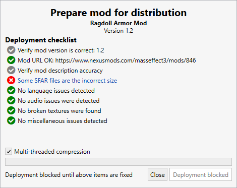

Deployment of your mod to an archive is done through the Mod Utils menu when your mod is selected. Deploying your mod to 7z packages it up and packs in a way that is quick to load in M3, use less memory to decompress for users, while balancing compression to reduce the file size. As of Build 113, mods that target moddesc.ini 6.0 or higher will be checked if they were deployed using M3, and if not, will throw a warning dialog to end users.
M3 packaging the mod ensures a consistent user experience. When M3 is not used to deploy the mod, users have experienced the following scenarios in the past:
 - Large mods that were compressed using 7z manually take significant time to read the moddesc.ini for importing - sometimes _several minutes_, when it's instantaneous on M3 deployed mods
 - Large mods may use _multiple gigabytes_ of memory to decompress due to poorly chosen dictionary sizes on the archive
 - Mods may not even _parse_ and/or work due to broken features that could have been easily tested for in the deployment step

When deploying a mod through M3, a series of checks are conducted on the mod. Critical issues will block deployment, while less critical ones can be treated as warnings. They should still be fixed before deployment, but they will not prevent deployment.

When deploying your mod, there are several things to keep in mind:
1. Deploying a mod requires a vanilla game backup. Backups are used to check against for things like out of bounds audio references, which can cause game instability.
2. Ensure all referenced content is installed into the current active target in M3. The target should not be texture modded, or it will cause many false positives on broken textures. If you have compatibility files in your mod, the files they are applied to should likely be installed - in the textures will point to that mod's TFC, for example.

M3 will block deployment if any of the following items are found:
- **SFAR file checks**
    - If SFAR is not 32 bytes
       - Modding tools use an SFAR size of 32 to determine if a DLC is unpacked or not. Mods do not use packed SFAR files, so they must always be 32 bytes.
- **Language file checks**
    - (ME2/ME3 only) If Custom DLC does not have mount.dlc file
       - mount.dlc files are required to load a DLC. It is in this check as the mount.dlc file also lists the TLK name reference for a DLC.
    - (ME2 only) If Custom DLC does not have BioEngine.ini file in CookedPC
       - BioEngine.ini files list the module number for a DLC in ME2, which determines the TLK filenames.
    - (ME2 only) If BioEngine.ini does not list module number > 0
       - Module IDs for mods deployed by M3 must be greater than zero.
    - (ME2/ME3 only) If Custom DLC has no TLK files
       - Mods deployed by M3 must have at least one TLK file, as a string must be present to show to the user if the DLC fails to load.
    - (ME2/ME3 only) If the mount.dlc listed DLC name stringref is not found in the TLK for every localization file
       - The string reference (tlk id) is not found in the mod's TLK, it will show a blank error message to the end user if the DLC fails, or worse, a string from another DLC (or the basegame) that is completely misleading. 
    - (ME1 only) If the Autoload.ini file does not list the value `GlobalTalkTable1` under `Packages`.
       - This value determines the filename and exportname of the TLK package file for the DLC. While this string is not shown to the user (that we are aware of, as of this writing), it may be used in the future and must be valid and present. 
    - (ME1 only) If the Autoload.ini file does not list a valid integer value for `NameStrRef` under `GUI`
       - This value is used to look up the TLK string reference for the name of the DLC mod.
    - (ME1 only) If the TLK package cannot be found in the mod folder
       - A TLK package file must exist for every DLC mod in ME1. The value `GloablTalkTable1` should end with '_tlk' - the value before this is the name of the package file.
    - (ME1 only) If the TLK export cannot be found in the TLK package file
       - ME1 looks for an export with the object name following the final . in the `GlobalTalkTable1` value. This export must be of the class `BioTalkTable`.
    - (ME1 only) If the stringref can't be found in the TLK export
       - Mods must contain a valid TLK string reference into their TLK package file.
- **Audio checks**
  - No blocking checks currently
- **Texture checks**
    - If a texture export references any `TexturesMEM` file cache
       - Mods being deployed are not allowed to use the same file cache names as MassEffectModder (the tool that installs textures for ALOT Installer)
    - [Mod Manager 6.2] If a texture is pcc stored, has more than 6 mips, but does not set the `NeverStream` flag to true
       - The game will crash trying to load the higher mips if this value is not set. Textures using more than 6 mips should most times be stored externally to improve game performance, but this is not required by M3
- **Miscellaneous checks**
    - If mod references any files named _metacmm.txt
       - _metacmm.txt files are autogenerated by managed installers (M3, ALOT Installer, etc) for Custom DLCs that are installed. It identifies the mod name, version, and other information. These files cannot be included in mods as they are auto generated. Remove these files from your mod.
    - If a package file has no names, imports, or exports
       - If a package file has no names, no imports, or no exports (note the term or, not and), it will break other tools that expect package files to contain at least one of each of these. Empty package files cannot be included in mods.
    - If a mod's moddesc.ini lists `unofficial=true` or `importedby`
       - Mods that are imported through the 'Import already installed Custom DLC' feature lose their moddesc.ini features and just use a generic template. While you may have customized your moddesc.ini, you may have not, so if these values are found, deployment is blocked until they are removed, which forces you to look over your moddesc.ini file.
       
       
       
