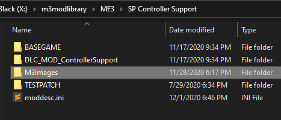
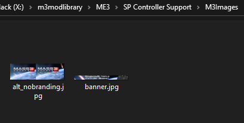
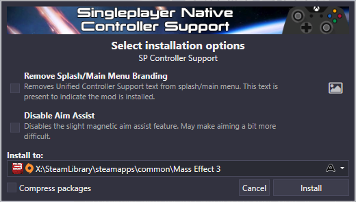
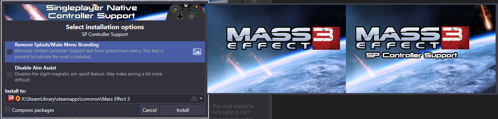

# Images in Mod Manager
Mod Manager 6.2 introduced support for images in mods. For a long time, there were no images in Mod Manager due to the extra complexity of dealing with image formats and the difficulty of extending the codebase further in Mod Manager 5. With the rewrite of Mod Manager 6, it was more feasible to add images, but installing mods from archive added significant technical challenges that prevented adding images to mods. With Mod Manager 6.2, images can now be used in different areas of the application.

Mods targeting `cmmver` 6.2 and higher can add images under the `M3Images` directory at the root of their mod. Images in these folders will be packaged with your mod as long as they are referenced and will be shown to users. All images that Mod Manager will use **must** be stored under the M3Images directory.



Images you want to display in the interface can be placed under here. Supported formats include PNG and JPG. I recommend JPG for images with lots of colors and PNG for stylized images, such as things like vector maps, etc, as the filesize will be smaller. The bigger your images, the more mod space it takes up and the more memory that will be required on end user systems.



## Mods that use images MUST be deployed with M3
Mods that use image features must be deployed using M3 - manually zipping your mod will make the mod fail to load in Mod Manager. There are many technical reasons for this requirement. Mod Manager will be able to detect when a mod is not deployed through it - do not attempt to work around this restriction.

## Banner images
ME3Tweaks Mod Manager starting with version 6.2 supports Mod Banner Images. These are images that appear at the top of the mod description panel as well as the top of the mod installer when your mod is selected.


Banner images must have an aspect ratio of `580x47`, which is the default displayable size at 100% DPI scaling. Images should account for higher DPI displays, so I recommend shipping for 200% DPI scaling, so use `1160x94`. Images with different aspect ratios will be rejected and make the mod fail to load.

The banner image is specified under the `ModInfo` header, using the descriptor `bannerimagename`. You specify the name of the image file under the M3Images directory.

```
[ModInfo]
...
bannerimagename = banner.jpg
```

## Alternate images
Both altfiles and altdlc support using images to help convey what the option will do for the user. When there is an image asset listed for an alternate, an image icon is shown to the right side of the alternate.



When the user mouses over the alternate item in the list, the image pops up.



To attach an image to an alternate option, you must specify 2 variables in your alternate's struct: `ImageAssetName` and `ImageHeight`.  `ImageAssetName` is the filename of the image under the `M3Images` directory. `ImageHeight` is the height to display the image at when at 100% DPI scaling. Valid values are between 1 and 1040. There is no width variable as it can be automatically calculated based on the height and the image dimensions.

The below example is for SP Controller Support on an altfile struct. The example same image variables could be applied to an altdlc struct.
```
[BASEGAME]
...
altfiles=((Condition=COND_MANUAL,
ModOperation=OP_SUBSTITUTE,
ModFile=\BIOGame\CookedPCConsole\Startup.pcc,
AltFile=BASEGAME/Startup-NoBranding.pcc,
Description="Removes SP Controller Support text from splash/main menu. This text is present to indicate the mod is installed.",
FriendlyName="Remove Splash/Main Menu Branding", 
ImageAssetName=alt_nobranding.jpg, 
ImageHeight=221))
```

You may be asking, why not just use the native size? This is to force developers to think about user screen real estate. Showing a 4K image on a user's 1600x900 display, taking over the entire display, leads to a bad experience. I recommend only shipping images large enough to get your point across. Trim out unnecessary parts of images and scale them down to a size that is reasonable. In the above alternate image, it has a height of 221 and a width of 720, which is about the maximum width I would recommend for images. As these images are only to convey information to the user, they do not need to worry about DPI scaling.

## Image considerations
Every image you add is loaded into memory when the mod is installed from archive. If your mod has 50 alternates, each with an image, and the user installs your mod from archive, this means 50 images (plus the banner image) are all loaded into memory. Images are stored uncompressed in the mod archive so they can be quickly loaded - this also means the mod archive size will increase. I suggest using JPG images for alternate images to help reduce the filesize and memory footprint of your mod.

Banner images in the mod library are always loaded once the mod is shown for the first time. A large mod banner may consume lots of memory for little benefit.
