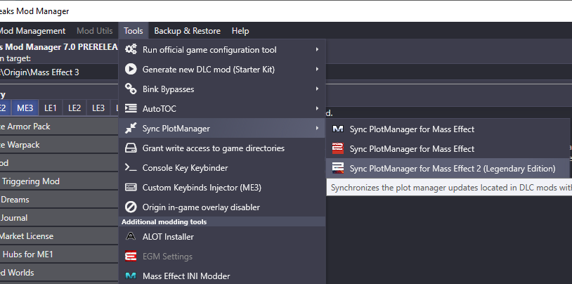

## Overriding Conditionals with .pmu Files
Plot Manager Update files, or .pmu files, are a method of overriding basegame conditionals in ME1, ME2, and LE2 while maintaining compatibility with other mods.

### The Problem

DLC mods for ME1 and ME2 can ship their own conditionals in a DLC's Startup_INT file, but unlike in ME3, conditionals in this file do not override the basegame conditionals. Previously, the only way to modify these conditionals was to ship a modified basegame PlotManager.pcc file, which immediately makes your mod incompatible with any other mods that also modify this file. 

Plot Manager update files are a new merge format in ME3Tweaks Mod Manager 7.0 that solve this problem. PMU files allow you to override and add new basegame conditionals without shipping the PlotManager.pcc file. Plot Manager updates can update the PlotManager.u file in ME1, and the PlotManager.pcc files in ME2 and LE2. Support for LE1 will be available when DLC modding is supported.

### Creating a PMU File

To add a .pmu file to your mod, create a text file called `PlotManagerUpdate.pmu` in your mod's CookedPCConsole folder. (The folder with your Mount.dlc file.) The file must be named exactly for M3 to locate it. 

In this text file, you will place the updated conditional functions, as they would be in the Script Viewer pane of Package Editor. A conditional function name must start with F, and have no leading zeroes. 

M3 will parse the conditionals in the file, validate and replace them on mod installation. You do not need to specify anything in your moddesc.ini to enable plot manager updates. You can use .pmu files in the alternates system in the exact same way you can use any other file.

```
public function bool F1221(BioWorldInfo bioWorld, int Argument)
{
    local BioGlobalVariableTable gv;
    
    gv = bioWorld.GetGlobalVariables();
    return gv.GetInt(399) == 0 && gv.GetBool(2738) == FALSE;
}
```

The above .pmu example file would update conditional 1221.

You can also add new conditionals by specifying a conditional ID that does not exist in the basegame. M3 will handle the relinking of the function chain. 

```
public function bool F1221(BioWorldInfo bioWorld, int Argument)
{
    local BioGlobalVariableTable gv;
    
    gv = bioWorld.GetGlobalVariables();
    return gv.GetInt(399) == 0 && gv.GetBool(2738) == TRUE;
}

public function bool F3050(BioWorldInfo bioWorld, int Argument)
{
    local BioGlobalVariableTable gv;
    
    gv = bioWorld.GetGlobalVariables();
    return gv.GetBool(6551) == TRUE;
}
```

The above example .pmu file would update conditional 1221, and add conditional 3050 to the basegame PlotManager.pcc file.

M3 will automatically sync Plot Manager updates similar to how it AutoTOCs the game on every mod install. You can also manually trigger a Plot Manager sync through the tools menu. It is important that your mod users know that **mods with .pmu files cannot be installed manually**, they must be installed through ME3Tweaks Mod Manager version 7.0 or above.

It is also worth mentioning that this system does not remove the ability to add conditionals in a DLC via Startup_INT. If you have a Startup file already, and you are only adding new conditionals, it may be easier for you to simply add them through the Startup file.

### Does installation order matter?

**No.** On every mod install, M3 will set the PlotManager.pcc file back to vanilla, and re-apply every mod's .pmu file **in mount order**. This way, mod installation order does not matter. If two mods alter the same conditional, the higher mounting mod will win. This also makes mod uninstallation easier. Simply remove the DLC folder from your game, and select Sync Plot Manager from the M3 Tools menu.



